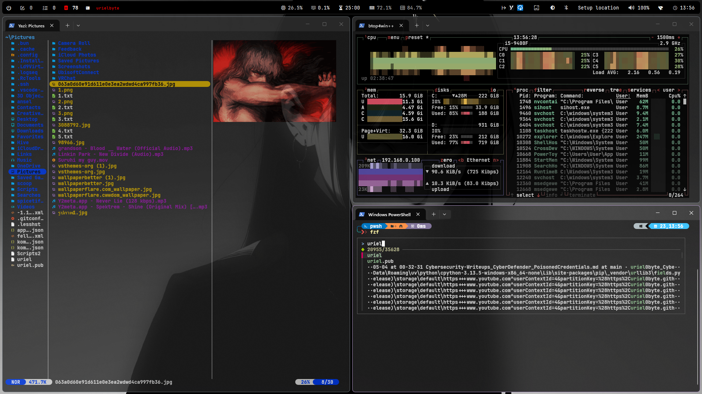
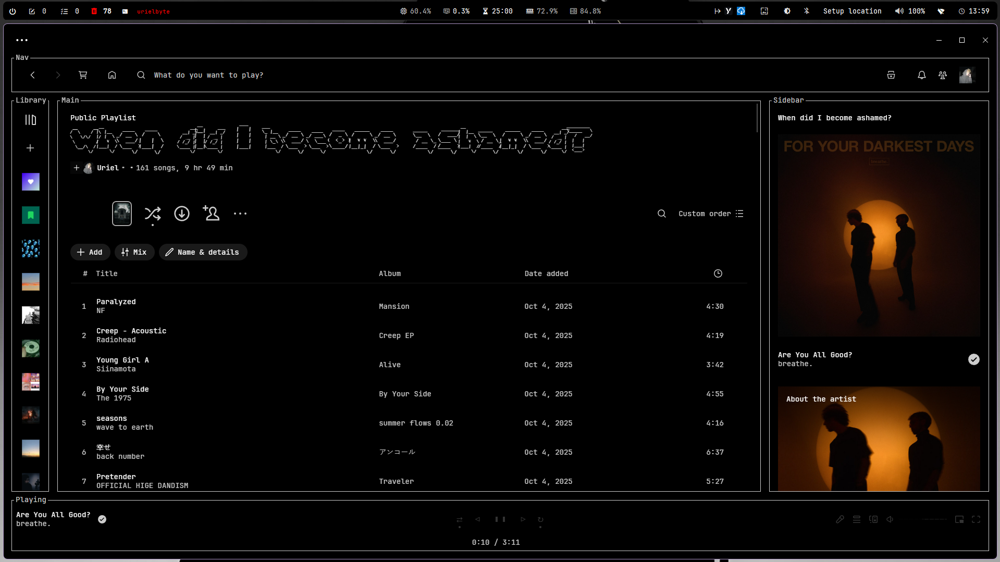
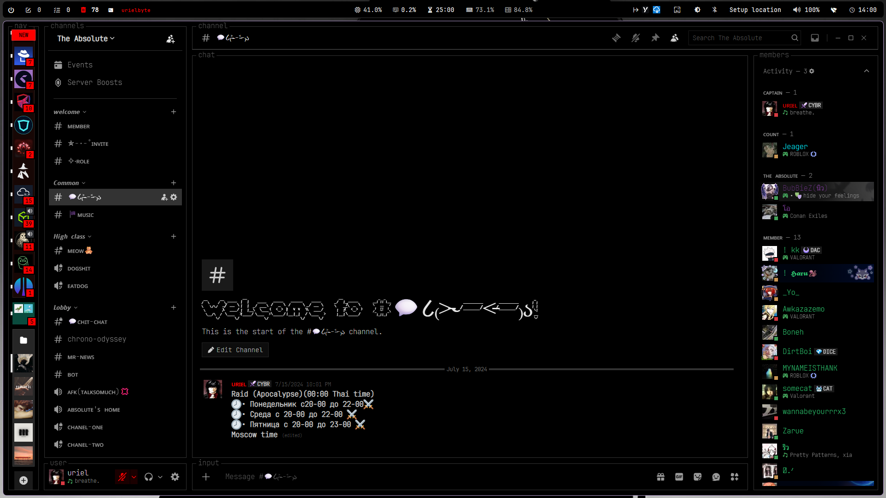

# 🦅 Uriel's Blue Team & TUI Triage Environment

 

 

 

This repository contains the configuration files, CLI toolkits, and symlink structures necessary to recreate my specialized Windows 11 environment. 

The goal of this setup is to create a high-contrast, monochrome, keyboard-centric workspace that emulates a native Linux terminal environment. This architecture optimizes muscle memory for SOC operations, log analysis, and OSINT investigations.

---

## 🛠️ The Core Toolkit (Linux on Windows)

I rely on the following command-line tools to bypass standard Windows GUI operations and parse data at speed.

### File Navigation & Management
| Tool | Purpose | Installation |
| :--- | :--- | :--- |
| **Yazi** | Blazing-fast terminal file manager (Vim-like navigation) | `winget install sxyazi.yazi` |
| **Zoxide** | Smarter `cd` alternative that learns directory habits | `winget install ajeetdsouza.zoxide` |
| **Eza** | Modern `ls` replacement (Icons, colors, grouping) | `winget install eza-community.eza` |
| **FD** | Lightning-fast alternative to the standard `find` command | `winget install sharkdp.fd` |

### Data Parsing & Investigation (Blue Team / OSINT)
| Tool | Purpose | Installation |
| :--- | :--- | :--- |
| **Ripgrep (`rg`)** | Extremely fast regex search inside files/logs | `winget install BurntSushi.ripgrep.MSVC` |
| **FZF** | Command-line fuzzy finder for filtering lists and history | `winget install junegunn.fzf` |
| **JQ** | Command-line JSON processor for formatting API/log data | `winget install jqlang.jq` |
| **yt-dlp** | Video downloading engine for OSINT artifact collection | `winget install yt-dlp` |

### System Utilities
| Tool | Purpose | Installation |
| :--- | :--- | :--- |
| **BTOP** | Native Linux-style resource and process monitor | `winget install aristocratos.btop` |
| **Oh My Posh** | Custom terminal prompt styling (`atomic` theme) | `winget install JanDeDobbeleer.OhMyPosh` |
| **FFmpeg** | Core engine for audio/video conversion and analysis | `winget install Gyan.FFmpeg` |
| **7-Zip** | Command-line archiving and extraction utility | `winget install 7zip.7zip` |
| **PowerSession** | Asciinema-style CLI session recorder for documentation | `winget install Watfaq.PowerSession` |

---

## ⚡ Command Hub (Flow Launcher)

PowerToys Run has been replaced by **Flow Launcher**, operating with a custom monochrome dark theme. It acts as the central execution hub, triggered via `Alt + Space`.

**Active Security Plugins:**
* **Everything:** Instant system-wide file indexing and retrieval.
* **Hash:** Instant MD5, SHA1, and SHA256 generation for malware artifact verification.
* **IP Address:** One-click retrieval and copying of local/public network IPs.
* **Sysinternals:** Instant execution of Microsoft diagnostic tools (Procmon, Autoruns).

---

## 🗺️ Workflow & Muscle Memory Cheat Sheet

A quick reference for daily operations, designed to keep your hands on the keyboard and out of the Windows GUI.

### 📂 Navigation & File Operations
| Action | Command | Details |
| :--- | :--- | :--- |
| **Smart Directory Jump** | `z <folder-name>` | Teleports instantly to the best match |
| **Jump to Previous Directory**| `z -` | |
| **List Files (Detailed)** | `eza -la` | Shows hidden files, permissions, and icons |
| **Visual File Manager** | `yazi` | Use `h`,`j`,`k`,`l` to navigate, `Enter` to open, `q` to quit |
| **Find a File by Name** | `fd "target_name"` | Searches recursively and ignores junk files |
| **Extract an Archive** | `7z x payload.zip` | |

### 🔎 Log Hunting & Data Parsing (SOC Core)
| Action | Command | Details |
| :--- | :--- | :--- |
| **Search Text Inside Logs** | `rg "Failed password"` | Searches all files in current directory |
| **Search Case-Insensitive** | `rg -i "malicious_ip"` | |
| **Format a JSON Log** | `cat data.json \| jq` | Colorizes and formats unreadable JSON walls |
| **Filter JSON for Data** | `cat logs.json \| jq '.event.ip_address'` | |
| **Fuzzy Find Files/History**| `fzf` | Interactive real-time filtering |

### 🕵️ OSINT & Media Processing
| Action | Command | Details |
| :--- | :--- | :--- |
| **Download Video Evidence** | `yt-dlp "<URL>"` | Pulls best quality video from a platform |
| **Extract Audio from Video**| `ffmpeg -i evidence.mp4 -vn output.mp3` | |
| **Generate File Hash** | `Alt + Space` -> `hash target_file.exe` | Uses Flow Launcher plugin |
| **Check IP Address** | `Alt + Space` -> `ip` | Uses Flow Launcher plugin |

### 💻 System & Environment Control
| Action | Command | Details |
| :--- | :--- | :--- |
| **Monitor System Resources**| `btop` | Press `q` to quit |
| **Trigger Command Hub** | `Alt + Space` | Launches Flow Launcher |
| **Reload PS Profile** | `. $PROFILE` | Applies dotfile changes without restarting terminal |

### 🐙 Git & Version Control (Dotfiles Management)
| Action | Command | Details |
| :--- | :--- | :--- |
| **Sync from Cloud** | `git pull` | Pulls the latest changes from GitHub to your PC |
| **Stage Changes** | `git add .` | Prepares all modified files for backup |
| **Lock in Changes** | `git commit -m "update config"` | Saves the state locally |
| **Push to Cloud** | `git push` | Uploads everything to GitHub |

### 🛡️ Sysinternals & Threat Hunting
| Action | Command | Details |
| :--- | :--- | :--- |
| **Hunt Persistence** | `autoruns` | Instantly pulls up every registry key, scheduled task, and service that starts with Windows to look for malware |
| **Deep Process Inspection** | `procexp` | Process Explorer: far more detailed than Task Manager, allows you to verify digital signatures of running apps |
| **Process Monitoring** | `procmon` | Process Monitor: a live-capturing timeline that records every file, registry, and network interaction an application makes in real-time |
| **Network Connections** | `tcpview` | Shows exactly which applications are connecting to which IP addresses in real-time |
| **Deep Logging** | `sysmon` | Performs deep, continuous monitoring of system activities and logs them directly to the Windows Event Log |
**Secure Deletion:** | `sdelete -p 3 <file>` | Cryptographically shreds a file. Use `sdelete -z C:` to wipe all free space on the drive. |

---

## 🎨 Theme Architecture

The visual design language across all applications is strictly high-contrast monochrome (Black/Grey/White) with pure red (`#FF0000`) reserved exclusively for critical system alerts.

* **Terminal:** Windows Terminal (Campbell/Black scheme) + `atomic` Oh My Posh theme.
* **Taskbar:** Custom GlazeWM/YASB configuration.
* **Discord:** [System24](https://github.com/refact0r/system24) custom TUI theme via BetterDiscord.
* **Spotify:** [Spicetify](https://spicetify.app/) running the `text` theme with custom HEX overrides.
* **Typography:** System-wide default monospace font is `JetBrainsMono Nerd Font`.

---

## 🛡️ Windows Provisioning & Hardening Runbook

When deploying a fresh Windows installation, GUI-based Control Panel setups are inefficient. Execute the following standard operating procedures (SOPs) to harden the OS, strip telemetry, and establish a secure baseline before installing the software loadout.

### Phase 1: Core OS Procedures
1. **System Debloat:** Run [Win11Debloat](https://github.com/W4RH4WK/Debloat-Windows-11) to strip out consumer telemetry, background tracking, and unneeded Windows Store applications to reduce the attack surface.
2. **Account Privilege Separation (Least Privilege Hardening):** 
   * Retain the initial account created during Windows setup strictly as a **Local Administrator** account for structural modifications, elevation prompts, and installs.
   * Create a separate **Local Standard User** account for daily workflow operations (browsing, studying, labbing) to prevent unauthorized malware persistence or system changes.
   * *Powershell command:* `New-LocalUser -Name "YourUsername" -Description "Daily TUI Workflow Account" -NoPassword`
3. **Disable Fast Startup & Hibernation:** Fast Startup locks the Windows drive kernel, causing corruption during dual-booting and blocking CLI boot record repairs. 
   * *Command:* Open Admin CMD and run `powercfg.exe /hibernate off`.
4. **Power Plan Architecture (Hardware Dependent):**
   * *For Desktop Workstations:* Open Admin PowerShell and run `powercfg -setscheme 8c5e7fda-e8bf-4a96-9a85-a6e23a8c635c` to unlock the "High Performance" plan for maximum CPU throughput.
   * *For Mobile Laptops:* Retain the "Balanced" power plan to optimize battery lifecycle and manage thermal throttling.
5. **Enable Full Disk Encryption:** Activate BitLocker immediately to secure physical data at rest. Backup the recovery key to an encrypted offline drive, not just a Microsoft account.
6. **Network Hardening:** Disable LLMNR and NetBIOS via Group Policy. These are legacy protocols that are easily poisoned during local network attacks.
7. **PowerShell Visibility:** Enable **PowerShell Script Block Logging (Event ID 4104)** via Group Policy to record the exact contents of executed scripts for forensic visibility.
8. **Network Configuration:** Rely on DHCP for the primary workstation to prevent connection failures on external networks. Reserve static IPs exclusively for stationary homelab hardware.
   
---

### Phase 2: Software Loadout & Inventory

The workstation relies on the following application stacks for development, security diagnostics, and media handling.

#### 🕵️ Security, Forensics & Blue Team
* **Sysinternals Suite:** `procexp`, `procmon`, `tcpview`, `autoruns` (Portable instances for rapid diagnostic execution via Flow Launcher).
* **VeraCrypt:** On-the-fly encrypted volume management.
* **HxD Hex Editor:** Raw memory and binary file analysis.
* **Tor Browser:** Secure and isolated OSINT navigation.
* **Password Management:** Bitwarden (Dedicated desktop client for secure, encrypted vault access).
* **Database Forensics:** DB Browser for SQLite (GUI for analyzing local app databases and extracting OSINT artifacts).

#### 🌐 Network & Infrastructure
* **Tunnels & VPNs:** Proton VPN, Tailscale, Cloudflare WARP.
* **Virtualization & Remote:** VMware Workstation, PuTTY.
* **Flash & Boot Management:** BalenaEtcher.
* **Packet Analysis:** Wireshark (The industry standard for deep network protocol and traffic analysis).
* **Network Mapping:** Nmap & Zenmap (CLI and GUI engines for network discovery, port scanning, and security auditing).

#### 💻 Hardware & System Diagnostics
* **Monitoring:** CPUID ROG CPU-Z, CPUID HWMonitor, TechPowerUp GPU-Z, MSI Afterburner.
* **Optimization:** Mem Reduct, Unpark CPU.
* **Storage Analysis:** CrystalDiskInfo, WizTree.
* **System Cleaning:** BleachBit (Open-source GUI for clearing telemetry cache and securely shredding files).

#### 🎨 Media, OSINT Capture & Editing
* **Video Production:** DaVinci Resolve, Adobe After Effects, Adobe Media Encoder, CapCut.
* **Audio Routing:** Voicemeeter, VB Cable, Audio Router.
* **Capture & Artifacts:** OBS Studio, PicPick, 4K Video Downloader+.
* **Image Processing:** Photoshop, GIMP, ImageMagick.

#### 🧠 Productivity, AI & Workspace
* **Knowledge Management:** Logseq.
* **Browsers:** Zen Browser, Brave.
* **AI Engines:** Claude, Perplexity.
* **Comms & Transfer:** Discord, Telegram, LINE, Proton Mail, Proton Drive, iCloud, Blip.
* **Utilities:** Recordly, Everything Search, WinRAR *(Note: 7-Zip CLI is primary for terminal ops)*, LOGA Deva Wireless Driver, NVIDIA App.
* **Office Suite:** LibreOffice (Open-source, telemetry-free document and spreadsheet processing).

#### 🛠️ Dev Toolkit & TUI Environment
* **Environment Core:** Flow Launcher, Komorebi, whkd, YASB Reborn, Pear Desktop, Oh My Posh.
* **IDE & Editors:** VSCodium (Telemetry-free code and Markdown editing).
* **Languages & Git:** Python, Java, Bun, Git.
* **CLI Arsenal:** PowerShell, btop4win, eza, fd, fzf, jq, zoxide, yazi, FFmpeg, PowerSession.

---

### Phase 3: Post-Deployment Auditing Scripts

The standard Windows Control Panel natively hides AppX packages, portable tools, and user-level installations. To verify a successful deployment or audit a machine, run these commands in PowerShell to dump the true software inventory to your desktop:

**1. Query Winget Managed Packages:**
```powershell
winget list > "$Home\Desktop\WingetApps.txt"
```

**2. Query Modern Windows Apps (AppX):**
```powershell
Get-AppxPackage | Select-Object Name, Version > "$Home\Desktop\ModernApps.txt"
```

**3. Query the Registry:**
```powershell
Get-ItemProperty HKLM:\Software\Wow6432Node\Microsoft\Windows\CurrentVersion\Uninstall\*, HKLM:\Software\Microsoft\Windows\CurrentVersion\Uninstall\*, HKCU:\Software\Microsoft\Windows\CurrentVersion\Uninstall\* | Select-Object DisplayName, DisplayVersion | Where-Object {$_.DisplayName -ne $null} | Sort-Object DisplayName > "$Home\Desktop\RegistryApps.txt"
```

---

## 🚀 Restoration Guide

*When setting up a fresh Windows installation, follow these steps to restore the environment:*

1.  **Clone the Repository:**
    `git clone https://github.com/YOUR_USERNAME/dotfiles.git $Home\Documents\GitHub\dotfiles`
2.  **Install Base Requirements:** Install Winget, Git, Windows Terminal, and PowerShell 7.
3.  Run Tool Installations: Run the included install.ps1 script to automate all winget downloads and rebuild the directory symlinks.

---
